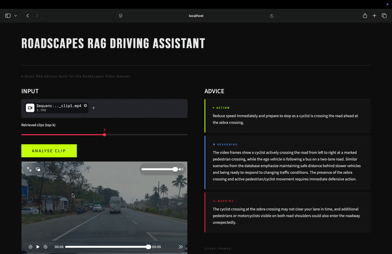

# Roadscapes RAG Driving Advisor

[](https://huggingface.co/datasets/vijpandaturtle/roadscapes-video)
[](https://huggingface.co/vijpandaturtle)
[](https://python.org)
[](https://anthropic.com)
[](https://huggingface.co/openai/clip-vit-base-patch32)

A demo multimodal RAG system that retrieves similar driving scenarios from a training dataset and generates structured driving advice using VLM.


## Demo




## What it does

Given a driving video clip, the system:

1. Extracts all frames and embeds them using CLIP
2. Searches a LanceDB vector index of training clips for the most visually similar scenarios
3. Passes the retrieved clips (with their verified labels) and sampled query frames to VLM
4. Returns structured driving advice — an action, reasoning, and warning


## Dataset

The system is built on the [Roadscapes Video Dataset](https://huggingface.co/datasets/vijpandaturtle/roadscapes-video) — a collection of dashcam video clips captured across diverse driving conditions, each annotated with structured natural language labels describing what the driver is doing and why.

### Structure

The dataset is split into train and test sets:

```
roadscapes-video/
  videos/
    train/
      Sequence_Day_1/
        clip1.mp4
        clip2.mp4
        ...
      Sequence_Night_1/
        ...
    test/
      Sequence_Day_1/
        ...
  roadscapes_x_train.csv   ← training labels
  roadscapes_x_test.csv    ← test labels
```

Each video clip is a short segment of continuous dashcam footage. Clips vary in scene type — daytime highway, urban intersections, night driving, rain, following vehicles, lane changes, and more.

### Label structure

Each clip in the CSV is annotated with four questions:

| Column | Question | Purpose |
|---|---|---|
| `action` | What is the action being performed by the ego vehicle? Answer in a single sentence. | Describes what the car is currently doing |
| `justification` | What is the justification for the current action? Answer in a single sentence. | Explains why the action is appropriate |
| `instruction` | What should the driver be doing now? Provide a definite action. | Ground-truth recommended action |
| `surroundings` | Tell me about the surroundings — weather, road type, time of day, and scenario in two sentences. | Scene context |

### Example annotation

```
Video File Name: clip_0023.mp4

Action:        The ego vehicle is maintaining a steady speed while following
               a truck on a two-lane road.

Justification: The road ahead is clear except for the leading truck, and
               the current following distance is safe.

Instruction:   Continue following the truck at a safe distance and monitor
               for any sudden braking or turn signals.

Surroundings:  The scenario takes place during daytime on a rural two-lane
               highway with dry road conditions. The weather is overcast
               with moderate visibility and no oncoming traffic.
```

### Why this structure matters for RAG

The four-question annotation format is what makes this dataset particularly useful for retrieval-augmented generation. Each label captures a different layer of situational understanding:

- **Action** answers *what is happening*
- **Justification** answers *why it is appropriate*
- **Instruction** answers *what to do next*
- **Surroundings** answers *what the scene looks like*

During retrieval, the system finds clips whose visual embeddings are closest to the query. During synthesis, VLM receives all four label fields for each retrieved clip — giving it rich, verified context to ground its advice rather than reasoning from visual frames alone.


## How `advise.py` was built

### The core idea

The system is a retrieval-augmented generation (RAG) pipeline where the retrieval is visual rather than text-based. Instead of embedding text chunks, we embed video frames using CLIP and store them in a vector database. At query time, we embed the query clip the same way and find the most similar training clips by cosine similarity.

VLM then acts as the synthesis layer — it reads the retrieved scenarios and their ground-truth labels, looks at the actual query frames, and reasons across all of it to produce grounded advice.


### Step 1 — Device setup

```python
def get_device():
    if torch.backends.mps.is_available():
        return torch.device("mps")
    if torch.cuda.is_available():
        return torch.device("cuda")
    return torch.device("cpu")
```

Picks the best available device — Apple Silicon MPS, CUDA GPU, or CPU as fallback.


### Step 2 — CLIP model

```python
def load_clip(device):
    model     = CLIPModel.from_pretrained("openai/clip-vit-base-patch32").to(device)
    processor = CLIPProcessor.from_pretrained("openai/clip-vit-base-patch32")
    model.eval()
    return model, processor
```

We use OpenAI's CLIP ViT-B/32 from HuggingFace. CLIP is key here because it was trained on image-text pairs, so its visual embeddings are semantically meaningful — similar scenes end up close together in the 512-dimensional embedding space.


### Step 3 — Embedding

Two embedding functions are used depending on the input type:

**Frames (visual query):**
```python
@torch.no_grad()
def embed_frames_clip(frames, model, processor, device, batch_size=32):
    # processes frames in batches, returns (N, 512) embedding matrix
```

Frames are batched through CLIP's image encoder and L2-normalised. We then take the mean across all frames to get a single clip-level embedding.

**Text (optional enrichment):**
```python
@torch.no_grad()
def embed_text(text, model, processor, device):
    # returns (1, 512) text embedding
```

If a label CSV is provided, the label text is embedded and fused with the visual embedding:

```python
fused = 0.7 * visual_mean + 0.3 * text_emb
```

This weighted fusion lets the label text nudge the query toward semantically matching scenarios even if the visual appearance differs slightly.


### Step 4 — Video frame extraction

Two helpers handle frame extraction:

```python
def extract_all_frames(video_path):
    # reads every frame — used for building the query embedding

def sample_frames(video_path, n=5):
    # samples n evenly-spaced frames — used for sending to VLM
```

All frames are used for embedding (more frames = better representation). Only 5 sampled frames are sent to VLM to keep token cost low.


### Step 5 — LanceDB retrieval

```python
def retrieve_top_k_clips(query_vec, table, top_k=3):
    results = (
        table.search(query_vec.flatten().tolist())
             .metric("cosine")
             .limit(top_k * 50)
             .to_list()
    )
```

We search with a large limit (`top_k * 50`) to get many candidate frames, then deduplicate by clip name keeping only the best-scoring frame per clip. This avoids returning 3 frames from the same clip — we want 3 distinct scenarios.

The score is converted from cosine distance to similarity: `score = 1.0 - distance`.


### Step 6 — VLM synthesis

The system prompt instructs VLM to act as a driving advisor and respond only in JSON:

```json
{
  "action": "What the driver should do RIGHT NOW.",
  "reasoning": "Why, referencing the retrieved scenarios.",
  "warning": "The most important hazard to watch for."
}
```

The user message includes:
- The 5 sampled query frames as base64 images
- The top-k retrieved scenarios with their full label text (action, justification, surroundings, recommended action)
- A prompt asking VLM to synthesise across all of it

VLM sees both the visual context (frames) and the textual context (retrieved labels) simultaneously — this is the multimodal part of the pipeline.


### Step 7 — CLI entry point

```python
def main():
    parser = argparse.ArgumentParser()
    parser.add_argument("--clip",        type=str)   # path to video
    parser.add_argument("--text",        type=str)   # text description instead
    parser.add_argument("--top_k",       type=int, default=3)
    parser.add_argument("--output_json", type=str)   # optional save path
```

The CLI accepts either a video clip or a text description as input. The `build_query_vector` function handles both cases — if a clip is provided it embeds frames, if text is provided it embeds the text directly.


## File structure

```
advise.py       — core RAG pipeline
app.py          — Streamlit demo UI
ingest.py       — builds the LanceDB index from training clips
index/
  roadscapes.lancedb   — vector index (built by ingest.py)
```


## Indexing the dataset

Before running the advisor, you need to build the LanceDB vector index from the training clips. This only needs to be done once.

**1. Download the dataset from HuggingFace:**

```bash
pip install huggingface_hub
python -c "
from huggingface_hub import snapshot_download
snapshot_download(
    repo_id='vijpandaturtle/roadscapes-video',
    repo_type='dataset',
    local_dir='./data'
)
"
```

**2. Run the ingest script:**

```bash
python ingest.py \
  --video_dir data/videos/train \
  --label_csv data/roadscapes_x_train.csv \
  --db_path index/roadscapes.lancedb
```

This will:
- Extract all frames from every training clip
- Embed them using CLIP in batches
- Store the embeddings alongside the label metadata in LanceDB

Indexing time depends on the number of clips and your hardware. On MPS/GPU it takes a few minutes — on CPU expect longer. The resulting index lives at `index/roadscapes.lancedb` and is read by both `advise.py` and `app.py` at runtime.


## Usage

```bash
# from a video clip
python advise.py --clip path/to/clip.mp4

# from a text description
python advise.py --text "driving on a highway at night behind a truck"

# save output
python advise.py --clip path/to/clip.mp4 --output_json result.json

# run the demo UI
streamlit run app.py
```


## Dependencies

```
anthropic
torch
transformers
lancedb
opencv-python
Pillow
python-dotenv
streamlit
```


## Environment

Create a `.env` file in the project root:

```
ANTHROPIC_API_KEY=sk-ant-...
```